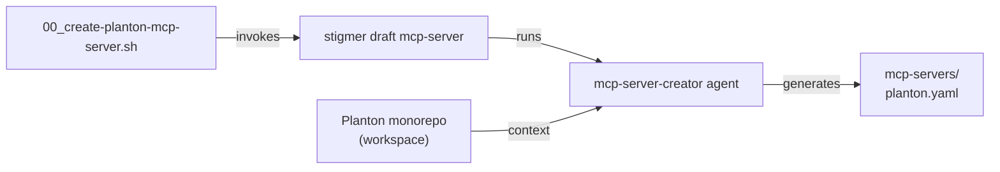

# Phase 1: Planton McpServer Tool Script

**Date**: March 3, 2026

## Summary

Created `tools/00_create-planton-mcp-server.sh` — the first tool script in the agent-fleet repository. This script invokes `stigmer draft mcp-server` with the Planton monorepo as workspace to generate a Stigmer McpServer YAML that declares the existing `mcp-server-planton` binary for use within the Stigmer platform.

## Problem Statement

Phase 1 of the agent-fleet project requires a Stigmer `McpServer` YAML definition for the Planton MCP server. Rather than hand-writing the YAML, the project uses Stigmer's own `mcp-server-creator` system agent to generate it — demonstrating Stigmer's self-extensibility and ensuring the output conforms to the `agentic.stigmer.ai/v1` schema.

### Requirements

- The tool script must follow the seedpack pattern established in `stigmer/seedpack/tools/`
- The Planton monorepo is the workspace (for domain understanding via docs and protobuf APIs)
- The `mcp-server-planton` repo is NOT included as workspace or attachment — server details are embedded in the prompt
- Output lands in `agent-fleet/mcp-servers/`
- The prompt must be rich enough for the agent to produce a production-quality YAML on first attempt

## Solution

A shell script that orchestrates the `stigmer draft mcp-server` command with:

1. **Workspace**: Planton monorepo — the agent can explore `docs/product/`, `apis/ai/planton/`, and `client-apps/cli/` for deep domain knowledge
2. **Spotlight attachments**: `docs/product/infra-hub`, `docs/product/service-hub`, `what-is-a-planton-api-resource.md`
3. **Prompt message**: Detailed instructions covering server connection (stdio, `mcp-server-planton` binary), env vars (`PLANTON_API_KEY`), 14 tool domains, 16 destructive tool approvals with `{{args.field}}` placeholders, and quality standards



### Script Architecture

```
tools/00_create-planton-mcp-server.sh
├── Header (purpose, prerequisites, usage)
├── Path resolution (SCRIPT_DIR, REPO_ROOT, PLANTON_REPO)
├── Dependency checks (stigmer CLI, planton repo)
├── Configuration (spotlight paths, output dir)
├── Existence verification
├── Prompt message (mktemp + trap cleanup)
├── stigmer draft mcp-server invocation
└── Post-generation next steps
```

### Key Design Decisions

**Planton-only workspace**: The `mcp-server-planton` repo is excluded. Server connection details (binary name, env vars, transport type) are embedded directly in the prompt. This keeps the workspace focused on domain knowledge. Exact tool names are provided for destructive operations in the prompt; `default_enabled_tools` is left empty (all tools available).

**Cross-repo path resolution**: `PLANTON_REPO` defaults to `../planton` relative to the agent-fleet root but can be overridden via environment variable for portability.

**Post-generation discovery**: The script's output guides the user through `stigmer discover mcp-server planton` to verify tool names match the approval entries.

## Implementation Details

### Prompt Coverage

The prompt message covers:

| Domain | What the Agent Learns |
|--------|----------------------|
| Server connection | stdio transport, `mcp-server-planton` binary, Go install command |
| Environment variables | `PLANTON_API_KEY` (secret), `PLANTON_ENVIRONMENT` (optional) |
| Workspace exploration | Paths to infra-hub docs, service-hub docs, protobuf APIs |
| Tool domains | 14 major categories (cloud resources, stack jobs, infra charts, etc.) |
| Approval policies | 16 destructive operations with templated approval messages |
| YAML requirements | `metadata.name: planton`, rich description, no status section |

### Destructive Tool Approvals

The prompt specifies 16 tools requiring human approval:

- Cloud resource: `delete_cloud_resource`, `destroy_cloud_resource`, `purge_cloud_resource`, `remove_cloud_resource_locks`
- Organization/environment: `delete_organization`, `delete_environment`
- Infra: `delete_infra_project`, `undeploy_infra_project`, `cancel_infra_pipeline`, `delete_infra_pipeline`
- Stack jobs: `cancel_stack_job`
- Services: `delete_service`, `cancel_pipeline`
- IAM/credentials: `delete_credential`, `revoke_org_access`, `delete_api_key`

## Impact

- **Phase 1 deliverable**: The primary tool script for the MCP server definition phase
- **Pattern establishment**: First tool script in agent-fleet — sets the pattern for Phase 2-6 scripts
- **Demonstrates Stigmer**: Uses Stigmer to build Stigmer resources — the self-extensibility story

## Related Work

- Phase 0: Repository scaffold (previous session)
- Follows seedpack tool script pattern from `stigmer/seedpack/tools/03_draft-mcp-server-creator-skill.sh`
- Next: Execute the script, review output, then proceed to Phase 2 (Cloud Resource Assistant)

---

**Status**: In Progress (tool script created, awaiting manual execution)
