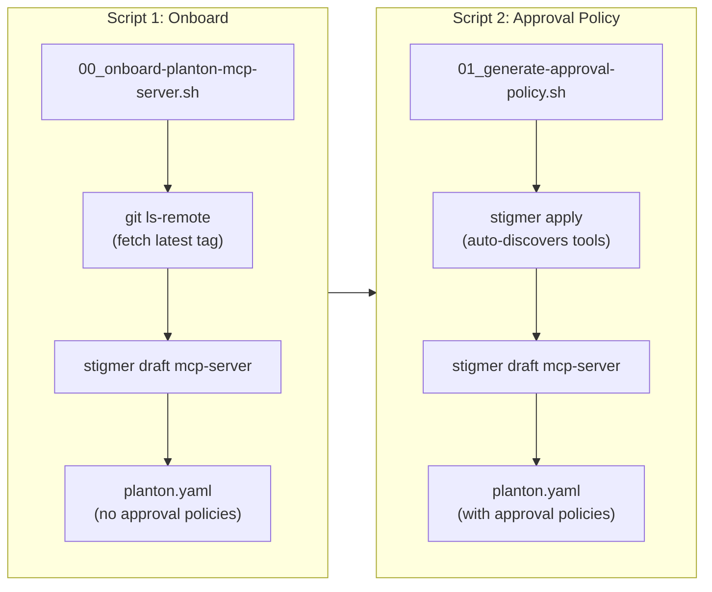

# Two-Script MCP Server Onboarding

**Date**: March 3, 2026

## Summary

Replaced the monolithic `00_create-planton-mcp-server.sh` (253 lines, 120-line hardcoded prompt) with two focused scripts that separate MCP server onboarding from approval policy generation. The new design eliminates all hardcoded tool names, descriptions, and approval messages — making the workflow fully dynamic and self-updating when the MCP server evolves.

## Problem Statement

The original script embedded everything in a single 120-line prompt: the full description text, all 16 destructive tool names with approval messages, environment variable descriptions, and metadata. This created two compounding problems:

### Pain Points

- Adding or renaming a tool in `mcp-server-planton` required manually updating the shell script
- The prompt dictated every detail instead of letting the mcp-server-creator agent explore and decide
- Tool approval policies were based on guessed names rather than actual discovered capabilities
- The `go run` pattern with a pinned version tag (used by `stigmer-mcp-server.yaml`) was not followed — the old script assumed a pre-installed `mcp-server-planton` binary in PATH

## Solution

Split the workflow into two scripts with a clear separation of concerns: scripts handle plumbing, agents handle thinking.



### Script 1: `00_onboard-planton-mcp-server.sh`

Resolves the `mcp-server-planton` and `planton` repos, fetches the latest version tag via `git ls-remote --tags --refs --sort=-v:refname`, then invokes `stigmer draft mcp-server` with a 7-line prompt. The agent explores the workspace to write description, env_spec, and metadata on its own. The `go run` command is pinned to the resolved tag, following the `stigmer-mcp-server.yaml` pattern:

```yaml
stdio:
  command: "go"
  args:
    - "run"
    - "github.com/plantonhq/mcp-server-planton/cmd/mcp-server-planton@v1.0.13"
```

### Script 2: `01_generate-approval-policy.sh`

Applies the McpServer YAML (triggering auto-discovery), then invokes `stigmer draft mcp-server` with a 5-line prompt. The agent queries the backend for `planton`'s discovered capabilities via `get_mcp_server`, identifies destructive tools by their nature, and generates approval policies with correct `{{args.field}}` placeholders from each tool's input schema.

## Implementation Details

### Agent prompt comparison

| Aspect | Old (monolithic) | New (Script 1) | New (Script 2) |
|--------|-----------------|-----------------|-----------------|
| Prompt length | 120 lines | 7 lines | 5 lines |
| Tool names | 16 hardcoded | None | Agent discovers |
| Description | Dictated | Agent explores | N/A |
| Env vars | Specified | Agent explores | N/A |
| Version tag | `@latest` | Pinned via `git ls-remote` | N/A |
| Approval messages | Dictated | N/A | Agent decides |

### Tag fetching

The script uses `git ls-remote` against the GitHub remote, which works without a local clone being up-to-date:

```bash
git ls-remote --tags --refs --sort=-v:refname \
    https://github.com/plantonhq/mcp-server-planton.git \
    | head -1 | awk '{print $2}' | sed 's|refs/tags/||'
```

### What agents figure out on their own

**Script 1 agent**: `spec.description` from README and code, `env_spec` entries from configuration handling, appropriate tags and labels from domain understanding.

**Script 2 agent**: Which tools are destructive (from names, descriptions, input schemas), approval messages with correct `{{args.field}}` placeholders, the complete updated YAML preserving existing fields.

## Benefits

- **Zero maintenance on tool changes**: Re-running the two scripts picks up new tools automatically
- **Dynamic version pinning**: Always fetches the latest tag — no manual version bumps
- **Agent autonomy**: Minimal instructions produce higher-quality, contextually-aware output
- **Separation of concerns**: Onboarding and policy generation are independent, re-runnable steps
- **Consistent pattern**: Follows `stigmer-mcp-server.yaml`'s `go run` + pinned tag pattern

## Impact

- **Developer workflow**: Two-step pipeline replaces manual prompt editing
- **Codebase quality**: Eliminates the largest source of static, hardcoded configuration in the tools/ directory
- **Forward compatibility**: The agent-fleet tooling now adapts to upstream MCP server changes without modifications

## Related Work

- Supersedes the Phase 1 tool script created in the previous session (`2026-03-03-090210-phase-1-planton-mcpserver-tool-script.md`)
- Follows the `stigmer-mcp-server.yaml` pattern from `stigmer/seedpack/mcp-servers/`
- Part of the broader agent-fleet project (`_projects/20260302.01.stigmer-resources-for-planton/`)

---

**Status**: Production Ready
